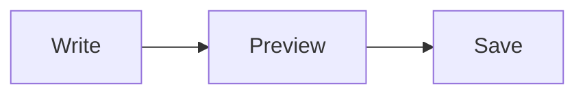
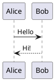

# Markitty

Markdown editor with claws.

Markitty is a lightweight, local-first Markdown editor for Windows, macOS, Android, and iOS. It is meant to feel small, fast, friendly, and Typora-inspired without becoming a full notes platform.

## Tech Stack

- React
- TypeScript
- Vite
- Tauri 2
- CodeMirror 6
- markdown-it
- DOMPurify
- Vitest

## Setup

```bash
npm install
```

## Development

Run the web app:

```bash
npm run dev
```

Run the Tauri desktop shell:

```bash
npm run tauri dev
```

## Build

Build the frontend:

```bash
npm run build
```

Build the Tauri desktop app executable without installer bundles:

```bash
npm run build:desktop
```

Build the Android release APK for current arm64 devices:

```bash
npm run build:android
```

Build the standard release outputs:

```bash
npm run build:all
```

## Test

```bash
npm test
```

## MVP Features

- Create a new Markdown document.
- Use browser-style tabs for multiple open Markdown documents.
- Edit Markdown with CodeMirror 6.
- Render Markdown preview with sanitized output.
- Render Mermaid and PlantUML fenced diagrams locally, with zoom, source view, and SVG export.
- Toggle edit, preview, and split modes on wide screens.
- Save drafts locally and recover them after restart.
- Open and save `.md` or `.markdown` files where platform support allows it.
- Use formatting toolbar actions for headings, bold, italic, inline code, code blocks, links, lists, and quotes.
- Insert Markdown image embeds and file attachments from local files.
- Use desktop keyboard shortcuts for bold, italic, save, new, and open.
- Switch between light and dark themes.
- See word count, character count, and save status.
- Use the shared Markitty cat icon across the app UI, favicon, and generated Tauri icons.

## Diagrams

Use a `mermaid` or `plantuml` fenced code block in a Markdown document:

````markdown



````

Aliases `mmd`, `puml`, `pu`, and `uml` also work, including nested and tilde
fences. A PlantUML fence can contain several `@start…` / `@end…` blocks;
simple snippets without markers are wrapped automatically.

Preview and split modes render diagrams on this device. The engines and
built-in PlantUML icons ship with the app; Java, a server, and an internet
connection are not required. Each diagram offers zoom, fit, source, copy,
and SVG export controls. Invalid diagrams show an explanation and their
source while the rest of the document remains readable.

The bundled PlantUML JavaScript engine does not support Ditaa, Salt wireframes,
nwdiag, or library listings. External includes, imported libraries, and external
data are unavailable; inline those definitions instead. Each diagram is limited
to 50,000 characters and previews render up to 100 diagrams per document.

Run the rendering checks in Microsoft Edge against the production build and
desktop content policy:

```bash
npm run build:web
npm run test:browser
```

## Screenshots

### Windows


## Roadmap

- Improve mobile native file import/export.
- Add find and replace.
- Add print/export options.
- Add optional line/word wrap preferences.

## License

MIT
